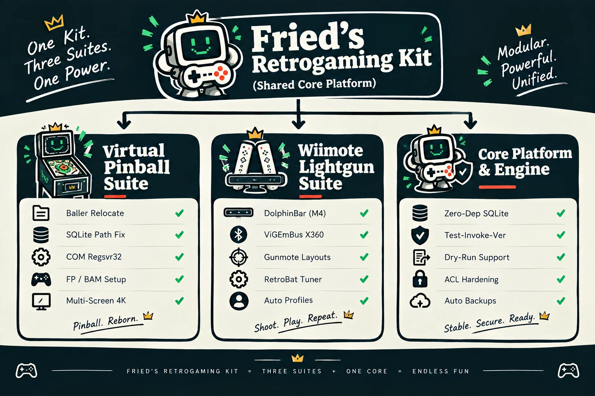
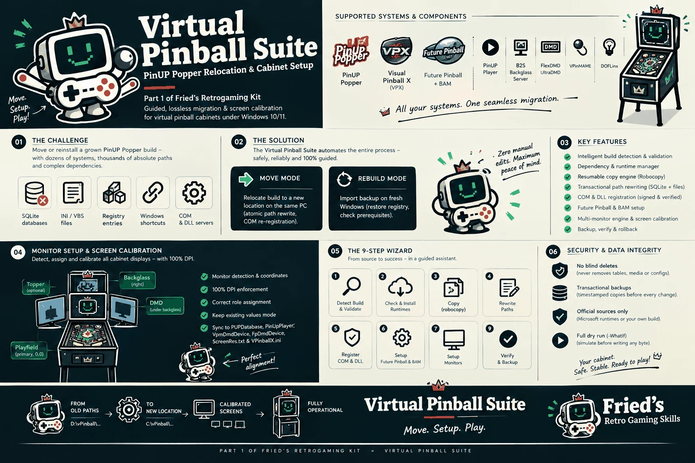
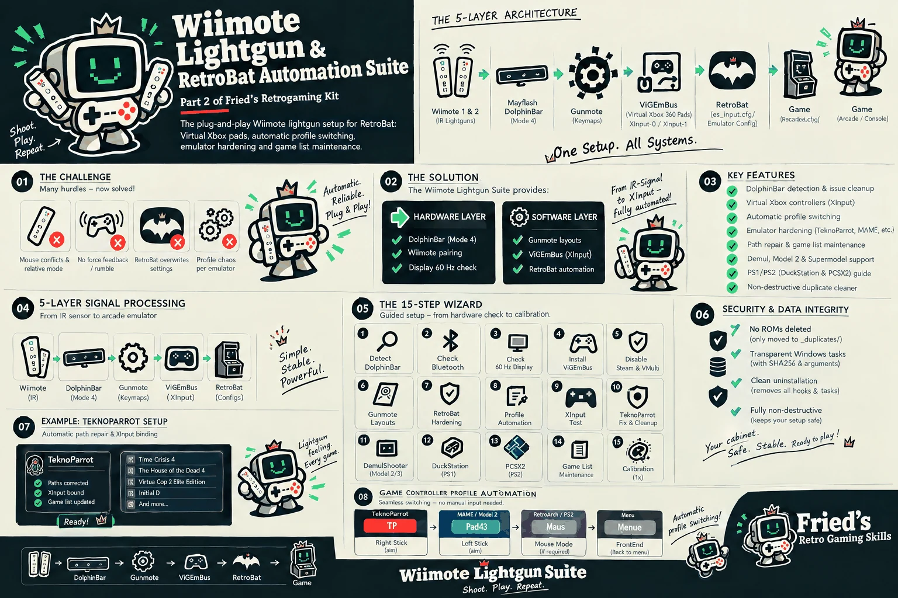
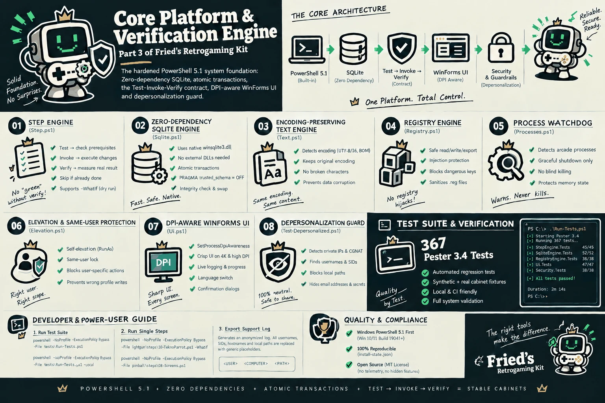

<div align="center">
  
  <h1>🕹️ Fried's Retrogaming Kit</h1>
  <p><strong>Die definitive Automations- und Setup-Suite für Windows Retro-Gaming- und Pinball-Cabinets</strong></p>

  [](https://github.com/kburna243/frieds-retrogaming-kit)
  [](https://github.com/kburna243/frieds-retrogaming-kit)
  [](LICENSE)
  [](docs/)
  [](https://kburna243.github.io/frieds-retrogaming-kit/)
  [](https://github.com/kburna243/frieds-retrogaming-kit/actions/workflows/ci.yml)
  [](tools/Test-Depersonalized.ps1)

  <p>
    <a href="README.de.md"><strong>Deutsch</strong></a> •
    <a href="README.md"><strong>English</strong></a> •
    <a href="docs/pinball-guide.de.md"><strong>Pinball-Anleitung</strong></a> •
    <a href="docs/lightgun-guide.de.md"><strong>Lightgun-Anleitung</strong></a> •
    <a href="docs/troubleshooting.de.md"><strong>Fehlerbehebung</strong></a> •
    <a href="docs/faq.de.md"><strong>FAQ</strong></a>
  </p>
</div>

---

> [!NOTE]
> **Status: v0.2.0.** Der gemeinsame Kern (`core\`), die Virtual-Pinball-Suite (`pinball\`, Schritte 1–9) und die Wiimote-Lightgun-Suite (`lightgun\`, Schritte 1–14 inklusive TeknoParrot, Demul + DemulShooter, Model 2 / Supermodel und geführter DuckStation-/PCSX2-Prüfung) sind einsatzbereit. Rumble ist geplant. Siehe [Funktionsstatus](#-funktionsstatus), [CHANGELOG](CHANGELOG.md) und [ROADMAP](ROADMAP.md).

---

## 💡 Was ist Fried's Retrogaming Kit?

Der Aufbau und die Wartung eines modernen Windows-Arcade- oder Flippergehäuses (Virtual Pinball Cabinet) waren bisher mühsam und fehleranfällig: Beim Umziehen von Ordnern brechen Pfade in kryptischen SQLite-Datenbanken; beim Anschließen von Wiimotes kollidieren Maustreiber, Cursor springen unkontrolliert, Steam kapert Controller und COM-DLL-Registrierungen schlagen lautlos fehl.

**Fried's Retrogaming Kit** löst diese Probleme mit einer auditierbaren, abhängigkeitsfreien PowerShell-Automationsplattform. Es verwandelt komplexe manuelle Einzelschritte in geführte, reproduzierbare Abläufe, bei denen **jede Aktion vorab geprüft, live verifiziert und vor jeder Änderung gesichert wird**.

Entwickelt von **Fried ([@kburna243](https://github.com/kburna243))** — von Arcade- und Flipper-Enthusiasten für Enthusiasten.

---

## 🏛️ Die drei Kernsäulen

<p align="center">
  
</p>

### 1. 🎱 Virtual Pinball Suite (`pinball\`)
- **Nahtloser Umzug & Wiederherstellung**: Verschiebt ein komplettes **Baller Installer**-Layout (PinUP Popper, Visual Pinball X, VPinMAME, B2S, FlexDMD, Future Pinball) auf ein neues Laufwerk (z. B. `E:\Old Build` ➔ `D:\Pinball`) oder stellt es auf einem frisch installierten Windows sauber wieder her.
- **Tiefes Umschreiben von Datenbanken & Konfigurationen**: Aktualisiert Tische, Emulatoren und Medienpfade in `PUPDatabase.db` direkt über die Windows-eigene `winsqlite3.dll` und passt `VPinballX.ini`, `PinUpPlayer.ini`, `ScreenRes.txt`, `DmdDevice.ini` sowie Registry-Einträge an.
- **COM-Komponenten-Orchestrierung**: Registriert `PinMAME.dll`, `B2S.Server.dll` und `FlexDMD.dll` in geprüfter Reihenfolge mit 32-Bit- und 64-Bit-Validierung.
- **Multi-Screen Kalibrierungs-Engine**: Erkennt Monitore DPI-bewusst (Playfield, Backglass, DMD/Topper), zeigt Differenz-Vorschauen vor dem Speichern, bewahrt bestehende Kalibrierungen und legt automatische Rollback-Backups an.

<p align="center">
  
</p>

### 2. 🎯 Wiimote Lightgun Suite (`lightgun\`)
- **Schlüsselfertige RetroBat-Integration**: Verwandelt RetroBat mithilfe von Nintendo Wiimotes und der Mayflash DolphinBar in ein echtes Lightgun-Arcade-Gehäuse.
- **Erzwungener Hardware-Modus 4**: Garantiert latenzarmes Infrarot-Tracking und Kopplung ohne lästige Windows-Bluetooth-PIN-Abfragen.
- **Virtuelle Xbox 360 Controller**: Nutzt signierte **ViGEmBus**-Treiber, um Lightguns als Standard-XInput-Pads bereitzustellen – Schluss mit chaotischen Windows-Mauskonflikten.
- **Intelligenter Schutz vor Störquellen**: Schaltet störende Steam-Desktop-Konfigurationen ab und deaktiviert kollidierende Maustreiber im Hintergrund.
- **Automatischer Profilwechsel**: Hintergrund-Dienste schalten Gunmote-Belegungen beim Spielstart automatisch um (MAME, DuckStation, TeknoParrot, Naomi) und kehren beim Beenden zu einem stabilen Menü-Pad zurück.

<p align="center">
  
</p>

### 3. ⚙️ Kernplattform & Verifikations-Engine (`core\`)
- **Vollständig abhängigkeitsfreie Architektur**: Läuft direkt auf jedem Standard-Windows 10 und 11 mit Windows PowerShell 5.1 und `winsqlite3.dll` – keine Paketmanager, keine externen Compiler.
- **Test → Invoke → Verify Zyklus**: Kein Schritt gilt als abgeschlossen ohne echte Messung. Jede Aktion wird getestet, ausgeführt und live verifiziert.
- **Vollständige Trockenlauf-Unterstützung**: Alle Skripte unterstützen `-WhatIf`. Änderungen an Dateien, Registry und Bildschirmkoordinaten lassen sich vorab gefahrlos einsehen.
- **Gehärtete Sicherheit & Datenschutz**: Setzt strenge NTFS-Rechte durch, prüft Authenticode-Signaturen bei offiziellen Microsoft/Nefarius-Downloads und garantiert 0 % Datenabfluss.

<p align="center">
  
</p>

---

## 🚦 Funktionsstatus

Was „unterstützt" bedeutet: **Automatisiert** = das Kit prüft, ändert und verifiziert; **Geführte Prüfung** = das Kit prüft und berichtet, du setzt die Änderung selbst; **Selbst mitgebracht** = du bringst das (Closed-Source-)Programm mit, das Kit konfiguriert drumherum.

| Bereich | Status | Was das Kit tut |
| :--- | :--- | :--- |
| **Kern** (Backup, Zustand, Log, Downloads, i18n) | ✅ Stabil | Gemeinsame Engine für alle Schritte |
| **Pinball** Umzug, COM-Registrierung, Bildschirme | ✅ Automatisiert | Schritte 1–9, Assistent `Start-Pinball.cmd` |
| **Lightgun-Basis** (DolphinBar, ViGEmBus, Gunmote, RetroBat) | ✅ Automatisiert | Schritte 1–9, Assistent `Start-Lightgun.cmd` |
| **MAME** | ✅ Automatisiert | RetroBat-Einstellungen (`use_guns=0`, XInput-Pads), Schritt 7 |
| **TeknoParrot** | ✅ Automatisiert | Profilpfade, XInput-Gun-Belegung, Spielelisten, Schritte 10–11 |
| **Demul + DemulShooter** (Naomi, Atomiswave) | ⚠️ Automatisiert · Demul selbst mitgebracht | Prüfungen, DemulShooter-Konfiguration, RetroBat-Einstellungen, Schritt 12 |
| **Model 2** | ⚠️ Automatisiert · Emulator selbst mitgebracht | Prüfungen und RetroBat-Einstellungen, Schritt 13 |
| **Supermodel** (Model 3) | ✅ Automatisiert | Fadenkreuz, XInput-Gun-Belegung, Schritt 13 |
| **DuckStation / PCSX2** | 🔎 Geführte Prüfung | Prüft Einstellungen und erklärt die Zuordnung, Schritt 14 |
| **Flycast** | ⛔ Nicht abgedeckt | — |
| **Doctor, Backups, Support-Paket** | ✅ Nur lesend / abgesichert | `Start-Kit.cmd -Doctor`, `-Backups`, `-SupportBundle` |
| **Rumble / Force-Feedback** | 🚧 Geplant | Siehe [ROADMAP](ROADMAP.md) |

---

## 🎛️ Hardware- & Systemanforderungen

| Komponente | Mindestanforderung | Empfohlene Cabinet-Ausstattung |
| :--- | :--- | :--- |
| **Betriebssystem** | Windows 10 64-Bit (21H2+) | Windows 11 64-Bit |
| **PowerShell** | Windows PowerShell 5.1 (Vorinstalliert) | PowerShell 5.1 oder PowerShell 7+ |
| **Pinball-Monitore** | 2 Bildschirme (Playfield + Backglass) | 3 Bildschirme (4K Playfield 120Hz + 1080p Backglass + DMD) |
| **Windows-Skalierung**| 100 % Skalierung (Zwingend erforderlich)| 100 % Skalierung auf allen Bildschirmen |
| **Lightgun-Sensor** | Mayflash DolphinBar (Firmware v09+) | Mayflash DolphinBar oben oder unten am Monitor |
| **Lightgun-Controller**| 1x Original Nintendo Wiimote | 2x Nintendo Wiimotes mit MotionPlus & Gun-Gehäuse |
| **Freier Speicher** | Build-Größe + 10 % Sicherheitspuffer | Schnelle NVMe-SSD (`D:\Pinball` oder `C:\RetroBat`) |

---

## ⚡ Schnellstart-Anleitung

### 1. Starten des Kits
Lade das Repository auf deinen Gaming-PC herunter und starte das Hauptmenü:
```cmd
:: Doppelklick im Explorer oder Aufruf in Eingabeaufforderung / PowerShell:
Start-Kit.cmd
```
*Oder starte die spezialisierten Assistenten direkt:*
- **Virtual Pinball Setup**: `Start-Pinball.cmd`
- **Wiimote Lightgun Setup**: `Start-Lightgun.cmd`

### 2. Virtual Pinball Umzug durchführen (Beispiel)
```powershell
# Änderungen vorab gefahrlos im Trockenlauf prüfen (-WhatIf)
powershell -ExecutionPolicy Bypass -File pinball\steps\05-Relocate.ps1 -Source "E:\Old Build" -Target "D:\Pinball" -WhatIf

# Vollständigen Umzug ausführen
powershell -ExecutionPolicy Bypass -File pinball\steps\01-Detect.ps1 -Source "E:\Old Build"
powershell -ExecutionPolicy Bypass -File pinball\steps\02-Target.ps1 -Target "D:\Pinball"
powershell -ExecutionPolicy Bypass -File pinball\steps\04-Copy.ps1
powershell -ExecutionPolicy Bypass -File pinball\steps\05-Relocate.ps1 -Mode Move
powershell -ExecutionPolicy Bypass -File pinball\steps\06-Register.ps1
powershell -ExecutionPolicy Bypass -File pinball\steps\08-Screens.ps1 -Mode Keep
powershell -ExecutionPolicy Bypass -File pinball\steps\09-Finish.ps1
```

### 3. Wiimote Lightgun konfigurieren (Beispiel)
Der Assistent (`Start-Lightgun.cmd`) führt diese Schritte der Reihe nach aus. Auf der Kommandozeile akzeptiert jeder Schritt zusätzlich `-WhatIf` für einen Trockenlauf.

```powershell
# PHASE 1 — Lightgun-Basis (RetroBat + Wiimote)
powershell -ExecutionPolicy Bypass -File lightgun\steps\01-Detect.ps1 -RetroBatRoot "C:\RetroBat"
powershell -ExecutionPolicy Bypass -File lightgun\steps\02-Hardware.ps1
powershell -ExecutionPolicy Bypass -File lightgun\steps\03-ViGEmBus.ps1 -AllowInstall
powershell -ExecutionPolicy Bypass -File lightgun\steps\04-Gunmote.ps1
powershell -ExecutionPolicy Bypass -File lightgun\steps\05-Interference.ps1 -DisableVMultiGuard
powershell -ExecutionPolicy Bypass -File lightgun\steps\06-GunmoteLayouts.ps1 -Mode Keep
powershell -ExecutionPolicy Bypass -File lightgun\steps\07-RetroBatSettings.ps1
powershell -ExecutionPolicy Bypass -File lightgun\steps\08-ProfileAutomation.ps1
powershell -ExecutionPolicy Bypass -File lightgun\steps\09-Verify.ps1 -XInputTimeoutSeconds 15

# PHASE 2 — Arcade-Emulatoren (optional, nur was du nutzt)
powershell -ExecutionPolicy Bypass -File lightgun\steps\10-TeknoParrot.ps1
powershell -ExecutionPolicy Bypass -File lightgun\steps\11-GameLists.ps1
powershell -ExecutionPolicy Bypass -File lightgun\steps\12-Demul.ps1
powershell -ExecutionPolicy Bypass -File lightgun\steps\13-Model2Supermodel.ps1

# PHASE 3 — Konsolen-Emulatoren (geführte Prüfung)
powershell -ExecutionPolicy Bypass -File lightgun\steps\14-DuckStationPcsx2.ps1
```

> [!TIP]
> Schritt 9 ist das Ende der **Basis**-Einrichtung, nicht des Kits: Die Schritte 10–14 ergänzen die Arcade- und Konsolen-Emulatoren. Emulatoren, die du nicht nutzt, werden einfach als fehlend gemeldet.

### 4. Doctor, Backups & Support-Paket
```cmd
:: Reine Prüfung von System, Pinball und Lightgun (OK / INFO / WARN / ERROR, Exit-Code 1 bei Fehlern)
Start-Kit.cmd -Doctor

:: Alle Backups des Kits auflisten (ZIP-Backups und <datei>.bak_*-Kopien), neueste zuerst
Start-Kit.cmd -Backups

:: Anonymisiertes Support-Paket für ein Issue (Doctor-Bericht, Umgebung, Schrittstatus, neueste Logs)
Start-Kit.cmd -SupportBundle
```
Dieselben drei Werkzeuge sind die letzte Seite beider Assistenten (**Wartung**), ganz ohne Kommandozeile. Einzelne Backups über die Kommandozeile prüfen, wiederherstellen, exportieren und löschen: `core\Start-KitTools.ps1` (`-CheckBackup`, `-RestoreBackup` mit `-WhatIf`, `-ExportBackup`, `-RemoveBackup`). Beim Wiederherstellen einer Dateikopie wird die aktuelle Datei zuerst gesichert, jede Wiederherstellung lässt sich also rückgängig machen.

---

## 🛡️ Sicherheit, Datenschutz & Integritäts-Prinzipien

Wir arbeiten nach strengen, unverhandelbaren Grundsätzen:
1. **Bring Your Own Builds (BYO)**: Das Kit enthält **keine** ROMs, BIOS-Dateien, kommerziellen Tische oder geschützten Grafiken. Du bringst deine eigenen legalen Spiele mit; das Kit übernimmt lediglich die Konfiguration.
2. **Nur offizielle, geprüfte Quellen**: Treiber und Hilfsmittel werden ausschließlich von offiziellen Herstellerseiten (Microsoft, Nefarius) bezogen. Jede Datei wird vor der Ausführung auf digitale Authenticode-Signaturen und SHA-256-Prüfsummen getestet.
3. **Zerstörungsfrei**: Das Kit löscht **niemals** deine Tische, ROMs oder Spielstände. Vor Konfigurationsänderungen werden automatische Backups erstellt.
4. **Standardmäßig Trockenlauf fähig**: Prüfe jeden Kopiervorgang, Registry-Eintrag und Monitor-Offset mit `-WhatIf`, bevor etwas geschrieben wird.
5. **Nur lokal**: Keine Telemetrie, keine Analyse, kein Konto, keine Cloud, kein Tracking. Netzwerkzugriff gibt es nur im geprüften Download-Modul (`core\modules\Download.ps1`); die CI schlägt fehl, wenn anderswo Netzwerkaufrufe auftauchen.
6. **Kein Datenabfluss**: Automatisierte CI-Scans (`tools\Test-Depersonalized.ps1`) stellen sicher, dass niemals private Hostnamen, IP-Adressen oder persönliche Benutzerpfade ins Repository gelangen.

---

## 📖 Dokumentations-Übersicht

| Handbuch | Beschreibung | Sprachlinks |
| :--- | :--- | :--- |
| **Virtual Pinball Handbuch** | Schritt-für-Schritt-Anleitung für Baller-Umzug, COM-Registrierung und Monitorkalibrierung. | [Deutsch](docs/pinball-guide.de.md) • [English](docs/pinball-guide.md) |
| **Wiimote Lightgun Handbuch** | DolphinBar Modus 4, ViGEmBus, Gunmote-Layouts und Profil-Automation. | [Deutsch](docs/lightgun-guide.de.md) • [English](docs/lightgun-guide.md) |
| **Fehlerbehebungs-Handbuch** | Schnelle Lösungen für COM-Fehler, Monitor-Verschiebungen, Steam-Konflikte und Drift. | [Deutsch](docs/troubleshooting.de.md) • [English](docs/troubleshooting.md) |
| **Häufig gestellte Fragen (FAQ)** | Antworten zu Architektur, Hardware-Kompatibilität und Sicherheit. | [Deutsch](docs/faq.de.md) • [English](docs/faq.md) |
| **Sicherheits-Richtlinie** | Sicherheitsmodell, Privilegien der Hintergrundaufgaben und Deaktivierung. | [English](SECURITY.md) |
| **Richtlinien für Beiträge** | Codierungsstandards, Pester-Tests und Pull-Request-Ablauf. | [English](CONTRIBUTING.md) |
| **Architektur** | Schichten, Schritt-Vertrag, Definition of Done, Qualitätsprüfungen. | [English](ARCHITECTURE.md) |
| **Changelog & Roadmap** | Änderungen je Version und nächste Schritte. | [Changelog](CHANGELOG.md) • [Roadmap](ROADMAP.md) |

---

## 🤝 Community & Danksagung

Fried's Retrogaming Kit baut auf der herausragenden Arbeit weltweiter Communities und Open-Source-Pioniere auf:
- **Communities**: [Light Gun Lunatics](https://lightgun.retrolunatics.com/) und [Pinball Lunatics](https://pinball.retrolunatics.com/) für unschätzbare Tutorials, Hardware-Tests und Community-Austausch.
- **Lightgun-Pioniere**: **Gunmote** (gunmotelabs), **Touchmote** (simphax), **Lichtknarre** (Geekonarium), **DemulShooter** (argonlefou) und **ViGEmBus** (Nefarius).
- **Frontend & Emulatoren**: **RetroBat Team**, **TeknoParrot** (Teknogods), **MAMEdev**, **DuckStation** (Stenzek), **PCSX2 Team**, **Flycast** und **Libretro**.
- **Virtual Pinball Pioniere**: **PinUP Popper & Player** (nailbuster), **Visual Pinball Team**, **PinMAME Team**, **B2S Backglass Server** (Herweh), **DMD Extensions** (freezy), **FlexDMD** (vbousquet) und **Future Pinball / BAM** (Ravarcade).
- **Inspiration**: Das deutsche Virtual-Pinball Community-Handbuch *"Projekt Virtual Pinball"* von **Moster** (flippermarkt.de / vpinball.de).

*Eine vollständige, ungekürzte Liste aller Mitwirkenden, Projekte und verifizierten Lizenzen findest du in [CREDITS.md](CREDITS.md).*

---

## 📄 Lizenz

Dieses Projekt steht unter den Bedingungen der **MIT-Lizenz**.  
Siehe [LICENSE](LICENSE) für den vollständigen Lizenztext.  
Copyright (c) 2026 Friedrich Börner.
